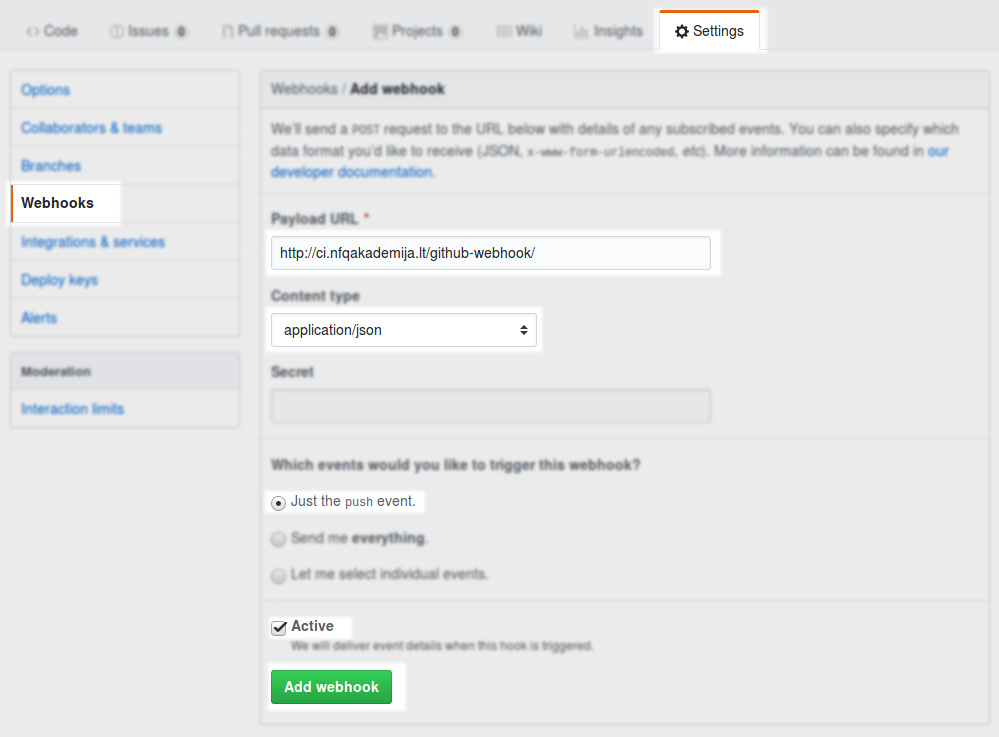

How to create new NFQ project?
==============================

```bash
git clone git@github.com:nfqakademija/test20181015.git
cd test20181015
```
Where `test20181015` is name of the project.

```
git remote add kickstart git@github.com:nfqakademija/kickstart.git
git pull kickstart master 
git push origin master
```

In WEB Server:
```bash
new-project.sh test20181015
```

* Create user in Jenkins: http://ci.nfqakademija.lt/securityRealm/addUser
   * User and password same as SSH

* Create job: http://ci.nfqakademija.lt/user/abanelis/my-views/view/all/newJob
   * Item name same as SSH user
   * `Copy from`: `kickstart`
* Configure job:
   * Update URL for project name
   * Source Code Management -> Git -> `Credentials`: `jenkins`
   * Enable 
   
* Add user access to his/her project: http://ci.nfqakademija.lt/role-strategy/manage-roles
   * `Project roles`:
      * `Role to add`: same as project user name
      * `Pattern`: same as project user name
      * Add `GitHub hook trigger for GITScm polling`
   * Save
* Assign roles: http://ci.nfqakademija.lt/role-strategy/assign-roles
   * Add `Global roles`: same as user name with `simple` rights
   * Add `Item roles`: same as user name with it's project rights

* Configure WebHook to auto trigger deployment in Jenkins
   * Github project -> `Settings` -> `WebHooks` -> `Add Webhook`
        * Payload URL: `http://ci.nfqakademija.lt/github-webhook/`
          (do not forget slash at the end, otherwise you will get 302 HTTP error)
        * Content type: `application/json`
        * Which events would you like to trigger this webhook? `Just the push events`
        * Active: _`Checked`_


