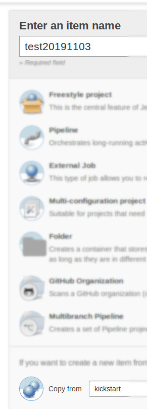

How to setup new project for new team
=====================================

* Clone `kickstarter` repository
* Create user+config+database in `*.projektai.nfqakademija.lt`
* Create user+job in `ci.nfqakademija.lt`
* (optional) Create webhooks in GitHub to deploy on master
* (optional) Create Slack integration to see status of deployment

## 1. Clone `kickstart` project

There were many discussions, how to create project for students (and no conclusion).

### 1.1 Create empty respository in GitHub


Prefer to use simple names (no spaces, no dashes) (e.g. `mynewproject`)
So same name could be used in Database name, Jenkins user and subdomain name (not use: _my-super_duper name_)

### 1.2 Push newest version of `kickstart`

As in GitHub example like:
> …or push an existing repository from the command line
> ```
> git remote add origin git@github.com:nfqakademija/test20181015.git
> git push -u origin master
> `

In some new folder:
```bash
git init .
git remote add upstream git@github.com:nfqakademija/kickstart.git
git fetch upstream
git merge upstream/master

git remote add origin git@github.com:nfqakademija/test20181015.git
git push -u origin master
```
Where `test20181015` is name of the project.

This will upload newest version of kickstarter project to your own team GitHub respository.

## 1.3 Add students 


Add mentor and students with `Admin` rights.
So everyone could do integrations, etc.

## 2. Setup Web server for new project

> It is usually done by one of the lecturers, who have _root_ access to WEB+CI servers (E.g. _Aurelijus_).

There is script (still being improved) to automate creation of the user:
```bash
new-project.sh test20181015
```
Where `test20181015` is project name

## 3. Setup Jenkins CI

> It is usually done by one of the lecturers, who have _root_ manages Jenkins in CI server.

## 3.1 Copy job template from `kickstart`

When logged in to [Jenkins](https://ci.nfqakademija.lt), click `New item`:


Use your GitHub project name and choose to copy from `kickstart`:



## 3.2 Change template to your project configuration

 * `GitHub project`: `Project url` should point to your GitHub repository
 * `Source Code Management`: `Git`: `Repository URL` should point to your GitHub repository
 
## 3.3 (Optional) ensure other configuration is also set

This should be already correct. For double check, there should be:

 * `Build Triggers`: `GitHub hook trigger for GITScm polling`
 * `Build`: `Execute shell` with calls to _build.sh_ and _deploy.sh_
 * `Post-build Actions`: `Slack notification`
 
## 3.4 (Optional) Create read-only permissions per project for debugging

So students could investigate errors them selves.

 * `Manage Jenkins`: `Manage users`: `Create User`: add user per project
 * `Manage Jenkins`: `Manage and assign roles`: `Manage roles`: `Project roles`: add your project
 * `Manage Jenkins`: `Manage and assign roles`: `Assign roles`: use matrix model to limit role access by job/project name

## 4. Create WebHook to deploy on `push` to master


* Payload URL: `https://ci.nfqakademija.lt/github-webhook/`
  (do not forget slash at the end, otherwise you will get 302 HTTP error)
* Content type: `application/json`
* Which events would you like to trigger this webhook? `Just the push events`
* Active: _`Checked`_

## 5. Create Slack integration to see Jenkins build status

By default all notifications are going to same channel.
But it is more convenient to have notifications per team (or project).

## 5.1. Configure (notifications per project) on Slack side
 


There should be `Jenkins` app already in added to Slack organisation:


Recommended to use channel per team (need to tell your channel name to Jenkins admin/lecturer).


This should give yout `Integration token`.
This will be needed in following steps (on Jenkins side).

## 5.2. Configure on Jenkins side

Mentors should have admin (`mentor` role) access to [ci.nfqakademija.lt](https://ci.nfqakademija.lt)

Choose your project (in Jenkins terminology it is called `job`):


Choose `Configure`:


Scroll down to `Post-build Actions` -> `Slack Notifications` and click `Advanced` button:


Configure `Project Channel` with **your team's** Slack channel name: 


You may want to click `Test Connection`.

**If there is `Failure`**. Configure:
* `Base URL`: `https://nfqakademija.slack.com/services/hooks/jenkins-ci/`
* `Integration Token`: _The one you got in previous step_

Try again `Test Connection`.

Finish configuration by clicking **`Save`**

## 5.3. Final result

So you could see build status:


And click link to Jenkins to see details, what went wrong:


