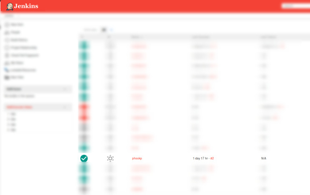

How to setup new project for new team
=====================================

* Clone `kickstarter` repository
* Create user+config+database in `*.projektai.nfqakademija.lt`
* Create user+job in `ci.nfqakademija.lt`
* (optional) Create webhooks in GitHub to deploy on master
* (optional) Create Slack integration to see status of deployment

## 1. Clone `kickstart` project

There were many discussions, how to create project for students (and no conclusion).

### 1.1 Create empty respository in GitHub


Prefer to use simple names (no spaces, no dashes) (e.g. `mynewproject`)
So same name could be used in Database name, Jenkins user and subdomain name (not use: _my-super_duper name_)

### 1.2 Push newest version of `kickstart`

```bash
git clone git@github.com:nfqakademija/test20181015.git
cd test20181015
```
Where `test20181015` is name of the project.

## 1.3 Add students 


Add mentor and students with `Admin` rights.
So everyone could do integrations, etc.

## 2. Setup Web server for new project

It is usually done by one of the lecturers, who manages WEB+CI servers.
There is script (still being improved) to automate creation of the user:
```bash
new-project.sh test20181015
```
Where `test20181015` is project name

## 3. Setup Jenkins CI

It is usually done by one of the lecturers, who manages WEB+CI servers.

* Creating user for debugging/manual start
* Creating Job to build/deploy
* Enabling `GitHub hook trigger for GITScm polling` for WebHooks
* Adding roles and permissions

## 4. Create WebHook to deploy on `push` to master


* Payload URL: `https://ci.nfqakademija.lt/github-webhook/`
  (do not forget slash at the end, otherwise you will get 302 HTTP error)
* Content type: `application/json`
* Which events would you like to trigger this webhook? `Just the push events`
* Active: _`Checked`_

## 5. Create Slack integration to see Jenkins build status

By default all notifications are going to same channel.
But it is more convenient to have notifications per team (or project).
 
## 5.1. Configure on Jenkins side (to have to your Slack channel)

Mentors should have admin (`mentor` role) access to [ci.nfqakademija.lt](https://ci.nfqakademija.lt)

Choose your project (in Jenkins terminology it is called `job`):



Choose `Configure`:


Scroll down to `Post-build Actions` -> `Slack Notifications` and click `Advanced` button:


Configure `Project Channel` with **your team's** Slack channel name: 


You may want to click `Test Connection`.

Finish configuration by clicking **`Save`**

## 5.2. Configure (notifications per project) on Slack side
 


There should be `Jenkins` app already in added to Slack organisation:


Recommended to use channel per team (need to tell your channel name to Jenkins admin/lecturer).


So you could see build status:


And click link to Jenkins to see details, what went wrong:

