How to enable xDebug
====================

Instruction is intended to be used with [NFQ Academy KickStart](https://github.com/nfqakademija/kickstart)
because it have some helper scripts to update xDebug configuration
and start connect to docker containers.

## 1. Assuming you are running docker containers

Start your containers (it is safe to rerun even containers are already started):
```bash
scripts/start.sh
```

To test:
```bash
docker ps --format '{{.Names}}'
```
Should print:
> ```
> php.symfony
> mysql.symfony
> nginx.symfony
> ```

## 2. Get Ip of your machine

### For Linux you can use docker interface

```bash
ifconfig docker0 | grep 'inet addr' | cut -d: -f2 | awk '{print $1}'
```
It should give something like:
>```
>172.17.0.1
>```

### For Mac (OS X) users use special DNS name

For [`Docker for Mac`](https://docs.docker.com/docker-for-mac/networking/#i-want-to-connect-from-a-container-to-a-service-on-the-host),
you can use:
>```
>host.docker.internal
>```

### For other situations use your network address

Use your computer's [LAN IP address](https://www.iplocation.net/find-private-ip-address)
(not the one of internet facing router)


## 3. Enable xDebug in php container

```bash
./scripts/backend.sh /enable_xdebug.sh 172.17.0.1
```
Where:
* `172.17.0.1` should be **replaced by your** IP address (or the one from previous section)

You should see something like
> ```
> Executing in PHP container: /enable_xdebug.sh 172.17.0.1
> xDebug enabled
> ```

## 4. Add a breakpoint in PHPStorm

Open `index.php` and click near line number, so red dot appears:

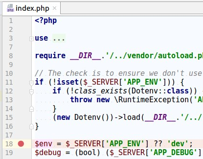

So execution during debugging could pause on this line.

## 5. Enable listening for xDebug in PHPStorm

In the right top corner:


Click on `Start listening for PHP Debug Connections`:


**Green** handset icon means xDebug is enabled.

## 5. Open your project in the browser

Open [127.0.0.1:8000](http://127.0.0.1:8000):

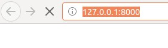

Your browser **will pause** waiting response from PHPStorm.
**Open PHPStorm** window.

## 6. Configure PHPStorm to map directories

### 6.1 Check that Debug tab appeared

On the right bottom side of PHPStorm you should see `Debug` panel popped up:

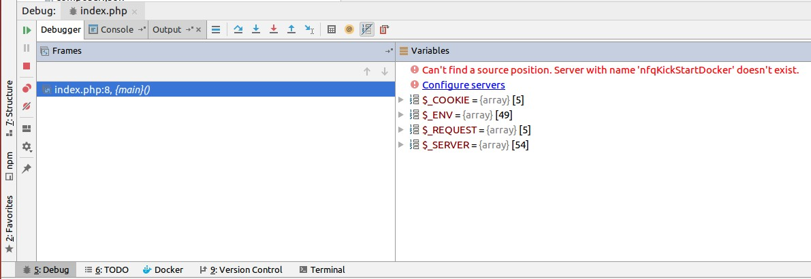

If you are setting up debugging for the first time,
there should be error message about `nfqKickStartDocker` server.

### 6.2 Configure Mappings for nfqKickStartDocker

* Click on `Configure servers` (or via `File`->`Settings`->`Language & Frameworks`->`PHP`->`Servers`)

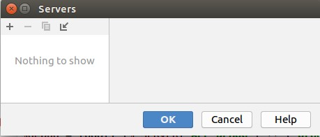

* Add new server configuration with `+` sign. Enter:
  * Name: `nfqKickStartDecker` (lower/upper case matters)
  * Host: `127.0.0.1`
  * Port: `8000`
  * Debugger: `Xdebug`
  * _`Checked`_ Use path mappings:
      * Near path of your project in _File/Directory_ column
      * Add `/code` in _Absolute path on the server_ column.
      * Value is **saved only** when you press **Enter**
        (or clicked somewhere else)
  * Save settings by clicking `OK`

  
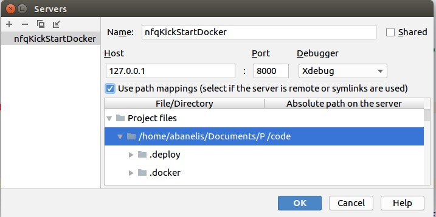

### 6.3 Verify that xDebug is working

* You should see error message gone in `Debug` panel:

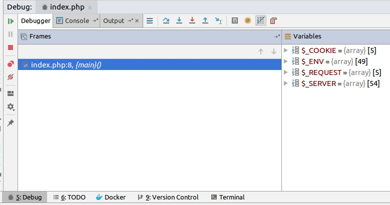

* Also you should see current xDebug step **marked in blue** in the code:

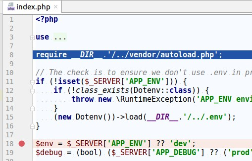

## 7. Use xDebug with command line/console

It may be useful to debug MySql connection during migrations
or other Symfony console functionality

### 7.1. Add breakpoint in bin/console

Symfony console commands are not going through _index.php_,
so add breakpoint in `bin/console` file:

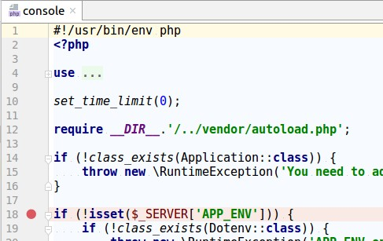

### 7.2 Go inside PHP container

Run in terminal:
```bash
./scripts/backend.sh
```
You should see bash prompt like:
> ```
> php@5372d0fc92d4:/code$
> ```

### 7.3 Enter some Symfony command

While still in PHP container, enter:
```bash
bin/console debug:router
```

Console will **pause execution** until PHPStorms allows to run further:

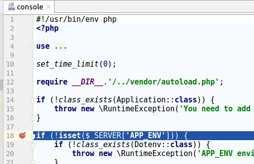

### 7.4 Get familiar with Debugging actions

`Debug` panel in PHPStorm have many useful actions (and those have keyboard shortcuts):

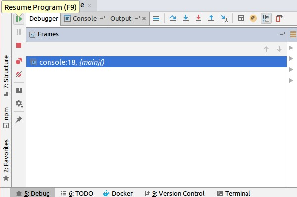

Common operations are:
 * `Resume Program` when you found the bug and want to go back to normal execution
 * `Stop` when there is no point in running program further (E.g. it will still fail)
 * `Step Over` to check what is happening when running line by line
 * `Step Into` to go inside function or other structure to debug there
 * `Variables` panel shows values of variables for current line
 
 Read more in [official PHPStorm documentation](https://www.jetbrains.com/help/phpstorm/debugging-with-phpstorm-ultimate-guide.html)
 
## 8. Disable xDebug
 
Usually you do not want to pause for each execution (especially for `composer install` and similar operations).
 
### 8.1 Disable in PHP container

Execute **in new terminal**:
```bash
scripts/backend.sh /disable_xdebug.sh
```
You should see output similar to:
>```
>Executing in PHP container: /disable_xdebug.sh
>xDebug is disabled
>```

So browser and console calls would not wait for PHPStorm

### 8.2 Disable in PHPStorm

Stop listening of Debug connections:


Useful for temporary stopping debugging.

## Common issues

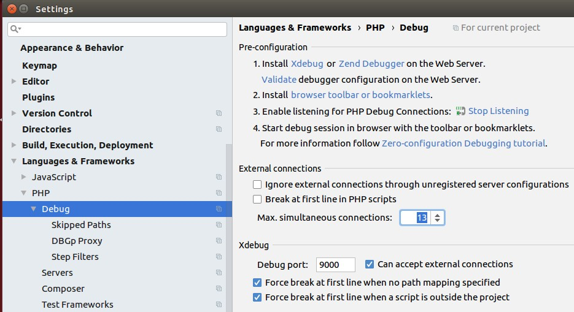
 
* You have only 1 simultaneous connection, but other are pending because of _console_ or _AJAX_ calls.
  So it is good practice to have higher number or check tabs in `Debug` panel
* You have mistyped IP in PHP container or bad `Server` name in `PHP`->`Servers` configuration.
* You have multiple PHPStorm programs opened, but xDebug listener is enabled on wrong window.
  Port can be assigned only to single application, so you cannot use 2 programs to receive xDebug calls.
* There is firewall for `9000` port connection
* For troubleshooting it is useful to temporary enable `Break at first line in PHP Scripts`
